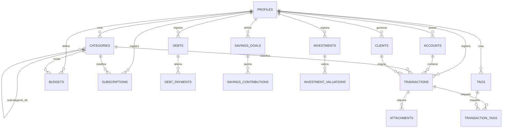

# 02 · Base de Datos — PostgreSQL (Supabase)

Modelo relacional normalizado (3FN), con Row Level Security en cada tabla. `auth.users` lo gestiona Supabase Auth; todo lo demás vive en el esquema `public`.

## 1. Modelo Entidad-Relación



## 2. Tablas

### 2.1 `profiles` (1:1 con `auth.users`)
| Columna | Tipo | Notas |
|---|---|---|
| id | uuid PK, FK → auth.users(id) | |
| full_name | text | |
| avatar_url | text | |
| default_currency | char(3) | ISO 4217, ej. `COP`, `USD` |
| locale | text | default `es-CO` |
| theme | text | `dark` \| `light` \| `system` |
| created_at / updated_at | timestamptz | |

### 2.2 `accounts` — cuentas (Efectivo, Nequi, Bancolombia, PayPal...)
| Columna | Tipo | Notas |
|---|---|---|
| id | uuid PK | |
| user_id | uuid FK → profiles | |
| name | text | |
| type | text | enum: `cash`,`bank`,`digital_wallet`,`credit_card`,`other` |
| institution | text | nullable |
| currency | char(3) | |
| initial_balance | numeric(14,2) | |
| account_number_encrypted | bytea | cifrado AES-256 vía `pgcrypto` — solo si el usuario decide guardar número de cuenta |
| color / icon | text | |
| is_archived | boolean | default false |
| created_at / updated_at | timestamptz | |

> El **saldo actual** no se guarda como columna editable: se calcula (`initial_balance` + suma de transacciones) mediante una vista (`v_account_balances`), evitando desincronización.

### 2.3 `categories`
| Columna | Tipo | Notas |
|---|---|---|
| id | uuid PK | |
| user_id | uuid FK | |
| name | text | |
| type | text | `income` \| `expense` |
| parent_id | uuid FK → categories(id), nullable | subcategorías |
| color / icon | text | |
| is_system | boolean | categorías por defecto no eliminables |
| created_at | timestamptz | |

### 2.4 `tags`
`id, user_id, name, color, created_at`

### 2.5 `clients` — clientes/negocios que generan ingresos
`id, user_id, name, color, icon, status (active/inactive), notes, created_at`

### 2.6 `transactions` — tabla central
| Columna | Tipo | Notas |
|---|---|---|
| id | uuid PK | |
| user_id | uuid FK | |
| account_id | uuid FK → accounts | |
| category_id | uuid FK → categories, nullable | |
| client_id | uuid FK → clients, nullable | solo aplica a ingresos por cliente |
| type | text | `income` \| `expense` \| `transfer` |
| amount | numeric(14,2) | siempre positivo; el signo lo da `type` |
| currency | char(3) | |
| description | text | |
| notes | text | nullable |
| transaction_date | date | |
| is_recurring | boolean | |
| recurring_rule | jsonb | nullable, ej. `{"freq":"monthly","interval":1}` |
| transfer_pair_id | uuid FK → transactions, nullable | vincula las 2 filas de una transferencia entre cuentas |
| deleted_at | timestamptz, nullable | soft delete (recuperable) |
| created_at / updated_at | timestamptz | |

### 2.7 `transaction_tags` (N:M)
`transaction_id FK, tag_id FK` — PK compuesta.

### 2.8 `attachments`
`id, transaction_id FK, user_id FK, storage_path text, file_name, file_type, file_size_bytes, created_at`
Archivos reales viven en **Supabase Storage** (bucket privado `attachments`), esta tabla solo guarda metadatos + ruta.

### 2.9 `budgets`
`id, user_id FK, category_id FK, amount numeric(14,2), period (monthly/yearly), start_date, end_date, alert_threshold_percent int default 80, created_at`

Vista `v_budget_progress` calcula gastado/disponible/porcentaje uniendo `budgets` + `transactions` del periodo.

### 2.10 `debts` — deudas (como prestamista o como deudor)
`id, user_id FK, creditor_name text, direction (i_owe/owed_to_me), principal_amount numeric(14,2), interest_rate numeric(5,2) nullable, start_date, due_date nullable, status (active/paid/overdue), notes, created_at`

### 2.11 `debt_payments`
`id, debt_id FK, amount numeric(14,2), payment_date date, notes, created_at`
Vista `v_debt_balance` = `principal_amount` − Σ pagos.

### 2.12 `savings_goals`
`id, user_id FK, name, target_amount numeric(14,2), target_date nullable, icon, color, status (active/completed/archived), created_at`

### 2.13 `savings_contributions`
`id, savings_goal_id FK, amount numeric(14,2), contribution_date date, notes, created_at`
`% completado` = Σ aportes / target_amount (vista `v_savings_progress`).

### 2.14 `investments`
`id, user_id FK, name, type (stocks/crypto/real_estate/business/other), amount_invested numeric(14,2), start_date, notes, created_at`

### 2.15 `investment_valuations` — historial de valor para calcular rentabilidad
`id, investment_id FK, value numeric(14,2), valuation_date date, created_at`

### 2.16 `subscriptions`
`id, user_id FK, name, category_id FK nullable, account_id FK nullable, amount numeric(14,2), currency, billing_cycle (weekly/monthly/yearly), next_billing_date date, status (active/paused/cancelled), icon, color, created_at`

### 2.17 `audit_log` — trazabilidad de seguridad
`id, user_id FK, action text, entity_type text, entity_id uuid, metadata jsonb, ip_address inet, user_agent text, created_at`
Se llena vía triggers en tablas críticas (`transactions`, `accounts`, `debts`) y en eventos de auth (login, cambio de contraseña).

### 2.18 `notifications`
`id, user_id FK, type (budget_alert/payment_due/subscription_renewal/goal_completed), title, message, is_read boolean, related_entity_type, related_entity_id, created_at`

## 3. Índices

```sql
-- Búsqueda y listados por usuario (el patrón de acceso más frecuente)
create index idx_transactions_user_date on transactions (user_id, transaction_date desc) where deleted_at is null;
create index idx_transactions_account on transactions (account_id);
create index idx_transactions_category on transactions (category_id);
create index idx_transactions_client on transactions (client_id) where client_id is not null;
create index idx_accounts_user on accounts (user_id) where is_archived = false;
create index idx_budgets_user_period on budgets (user_id, period, start_date);
create index idx_debts_user_status on debts (user_id, status);
create index idx_debt_payments_debt on debt_payments (debt_id);
create index idx_savings_goals_user on savings_goals (user_id, status);
create index idx_subscriptions_next_billing on subscriptions (user_id, next_billing_date) where status = 'active';
create index idx_investments_user on investments (user_id);
create index idx_audit_log_user_date on audit_log (user_id, created_at desc);

-- Búsqueda de texto (buscador global)
create index idx_transactions_description_trgm on transactions using gin (description gin_trgm_ops);
```

Requiere extensión `pg_trgm` para búsqueda difusa del buscador global, y `pgcrypto` para cifrado.

## 4. Row Level Security (RLS)

RLS **habilitado en todas las tablas de negocio**, sin excepción. Patrón estándar (ejemplo con `transactions`, se repite por tabla):

```sql
alter table transactions enable row level security;

create policy "select_own_transactions"
  on transactions for select
  using (auth.uid() = user_id);

create policy "insert_own_transactions"
  on transactions for insert
  with check (auth.uid() = user_id);

create policy "update_own_transactions"
  on transactions for update
  using (auth.uid() = user_id)
  with check (auth.uid() = user_id);

create policy "delete_own_transactions"
  on transactions for delete
  using (auth.uid() = user_id);
```

Para tablas hijas sin `user_id` propio (`debt_payments`, `savings_contributions`, `transaction_tags`, `attachments`, `investment_valuations`), la policy verifica el `user_id` de la tabla padre vía subquery:

```sql
create policy "select_own_debt_payments"
  on debt_payments for select
  using (
    exists (
      select 1 from debts
      where debts.id = debt_payments.debt_id
        and debts.user_id = auth.uid()
    )
  );
```

Esto es lo que hace que un `SELECT * FROM transactions` desde cualquier cliente (incluso con la `anon key` filtrada) **jamás** devuelva datos de otro usuario — la base de datos lo garantiza, no el código de la app.

## 5. Cifrado de datos sensibles

**Implementado:** los backups exportables (Configuración → Respaldo) se cifran client-side con AES-256-GCM (PBKDF2-SHA256, 210k iteraciones, salt e IV aleatorios por archivo) usando una contraseña que solo el usuario conoce — ver `src/infrastructure/export/backupCrypto.ts`.

**Diseñado, no implementado:** cifrado a nivel de columna (server-side, `pgcrypto`) para `account_number_encrypted` — `pgp_sym_encrypt(valor, clave)` / `pgp_sym_decrypt()`, con la clave simétrica en Supabase Vault. La columna existe en el esquema desde la migración inicial, pero ningún caso de uso ni repositorio la lee o escribe todavía; es la deuda técnica más visible del proyecto.

En cualquier caso: nunca se cifraría el monto de las transacciones (rompería agregaciones/reportes), solo identificadores/notas verdaderamente sensibles.

## 6. Vistas útiles (además de las mencionadas arriba)

- `v_monthly_summary(user_id, month)` → ingresos, gastos, balance del mes.
- `v_category_breakdown(user_id, month)` → gasto por categoría para gráficos de pastel.
- `v_client_totals(user_id)` → total generado por cliente (Bonarep, Trendencia, etc.).
- `v_net_worth(user_id)` → saldo total + invertido − deudas = patrimonio neto (KPI principal del dashboard).

## 7. Migraciones

Todo el esquema vive versionado en `supabase/migrations/*.sql` — 12 migraciones, una por tabla/feature, nunca se edita una ya aplicada a producción. Se generan y aplican con `supabase migration new <nombre>` + `supabase db push`.
